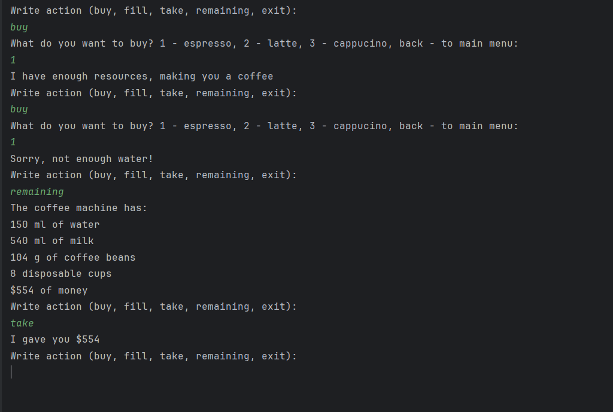

# Hyperskill-Coffee-Machine
A project as part of the Hyperskill Java certification, where we are given a prompt to make a coffee machine, and build it from scratch. 

It is a simple text based machine, designed to emulate an embbedded program for a coffee machine. It runs entirely in console. 

You can view the source code in either CoffeeMachine.java, download the "Coffee MAchine" file for intellij, or download the CoffeeMachine.java.html to open in your browser for easy viewing.  

Example of finished version running: 

  

This code is not intended for sale and should not be used for such purposes.
